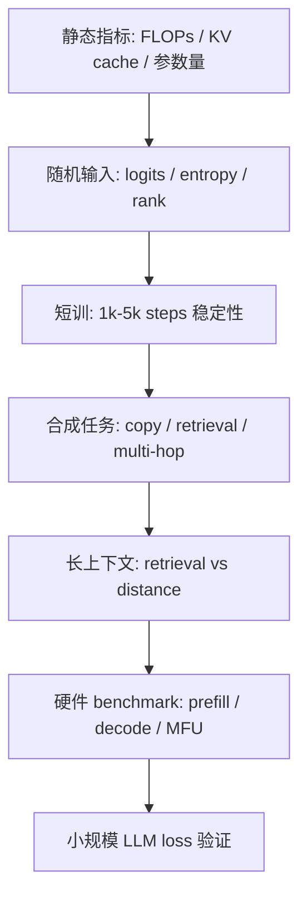
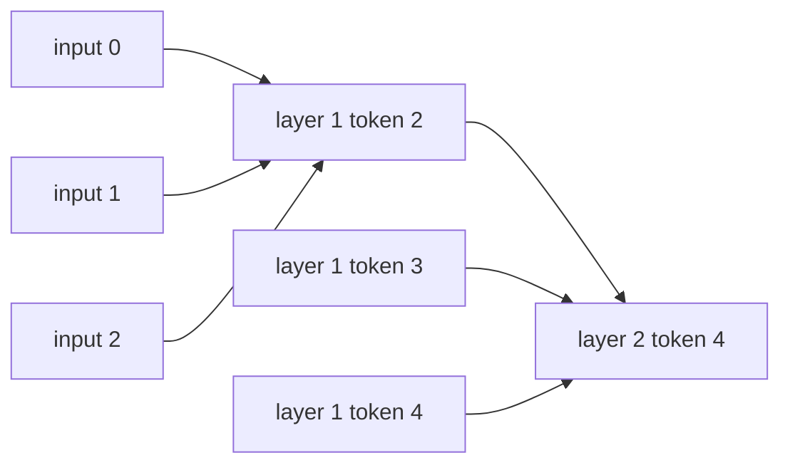

# Attention 设计评估指标学习笔记

这份笔记的目标是：在不完整训练一个 LLM 的情况下，用更可靠的 proxy 指标评估一个 attention 设计是否值得继续投入。它不能替代最终 pre-train loss，但可以提前暴露信息流、稳定性、表达力、长上下文和硬件效率问题。

配套文件：

- `attention_metrics_torch.py`：PyTorch 工具函数和一个 tiny Transformer。
- `attention_metrics_tutorial.ipynb`：Jupyter 实验 notebook。
- `CODE_WALKTHROUGH_ZH.md`：notebook 代码单元逐行解释。

运行方式：

```bash
cd /mnt/c/Users/Administrator/Desktop/模型训练/attention_design_metrics
python3 -m py_compile attention_metrics_torch.py
jupyter lab attention_metrics_tutorial.ipynb
```

## 1. Transformer Block 视角

现代 decoder-only LLM 的一个 block 可以抽象成：

```mermaid
flowchart LR
    A["token ids"] --> B["token embedding"]
    B --> C["RMSNorm / LayerNorm"]
    C --> D["Q, K, V projection"]
    D --> E["RoPE / position encoding"]
    E --> F["masked self-attention"]
    F --> G["residual add"]
    G --> H["RMSNorm / LayerNorm"]
    H --> I["MLP / SwiGLU"]
    I --> J["residual add"]
    J --> K["next block / lm_head"]
```



Attention 负责“信息路由”：当前 token 从历史 token 中取哪些信息。MLP 负责“非线性变换和容量”。Residual 和 norm 负责让深层网络稳定训练。RoPE 或其他位置编码让模型知道 token 的相对位置。

## 2. 评估总览

| 维度 | 指标 | 主要预测什么 |
|---|---|---|
| 信息流 | graph diameter, receptive field, rollout mass | 长距离依赖是否可传递 |
| 稳定性 | QK logits std/p99/p99.9, normalized entropy | attention 是否容易饱和或训崩 |
| 表达力 | effective rank, head diversity, head ablation | attention 是否退化或 head 浪费 |
| 位置能力 | retrieval vs distance, extrapolation ratio | 长上下文和长度外推 |
| 硬件 | tokens/sec, TTFT, TPOT, MFU, KV cache | 实际训练和部署可用性 |
| 小任务 | copy, key-value retrieval, multi-hop | 结构能力下限 |

一个 attention 设计不能只看单个指标。可靠评估应该同时看：



## 3. 信息流：Graph Diameter 与 Receptive Field

把 attention mask 看成一个有向图。第 `l` 层 token `t` 可以 attend 到上一层 token `s`，就有边：

```text
(l, t) -> (l-1, s)
```

第 `l` 层 token `t` 的 receptive field 定义为它能被哪些输入 token 影响：

```text
R_0(t) = {t}
R_l(t) = union over s in Attend_l(t) of R_{l-1}(s)
```

Graph diameter 是最远的 input-output token 对之间最少需要经过多少层：

```text
D = max shortest_path(input token i -> output token j)
```

例子：

- full causal attention：任意历史 token 一层可达，diameter 通常是 `1`。
- sliding window attention：如果 window 包含当前 token 和前 `w-1` 个 token，距离为 `d` 的信息大约需要 `ceil(d / (w-1))` 层。
- window=1：每个 token 只能看自己，历史信息永远不可达。

图示：



只看理论连通性还不够。更可靠的做法是算 attention rollout：

```text
A'_l = alpha * I + (1 - alpha) * A_l
Rollout = A'_L A'_{L-1} ... A'_1
```

其中 `I` 是 residual path，`A_l` 是第 `l` 层 attention matrix。然后按距离统计累计 attention mass：

```text
mass(distance > d) = sum Rollout[t, s] where t - s > d
```

如果理论可达，但远距离 mass 接近 0，长程依赖仍然弱。

## 4. 稳定性：QK Logits 与 Entropy

Attention logits：

```text
z_{t,s} = q_t · k_s / sqrt(d_head)
p_{t,s} = softmax(z_{t,s})
```

要统计：

```text
mean(z), std(z), p99(z), p99.9(z), max(z), min(z)
```

更推荐 `p99` 和 `p99.9`，不要只看 `max`。`max` 经常只是一个异常值。

Attention entropy：

```text
H_t = - sum_s p_{t,s} log p_{t,s}
```

由于不同位置可见 token 数不同，要归一化：

```text
H_norm = H_t / log(N_t)
```

其中 `N_t` 是 token `t` 能看到的 key 数。

解释：

- `H_norm` 接近 `1`：attention 接近平均分布，选择性弱。
- `H_norm` 接近 `0`：attention 极度尖锐，可能 softmax 饱和。
- 没有固定万能阈值，要分层、分 head、按 position bucket 比较。

可靠做法：

- 按 layer/head 分开统计。
- 按位置分桶：`0-1k`, `1k-4k`, `4k-32k`。
- 训练早期、中期、后期都看。
- bf16/fp8 下额外统计 NaN、Inf、overflow、loss spike。

常见改进：

- QK-Norm
- RoPE scaling
- attention temperature
- logit clipping
- 更保守的初始化
- residual scaling

## 5. 表达力：Effective Rank 与 Head Diversity

对 attention matrix 或 attention output 做 SVD：

```text
M = U Sigma V^T
```

奇异值归一化：

```text
p_i = sigma_i / sum_j sigma_j
```

Effective rank：

```text
r_eff = exp(- sum_i p_i log p_i)
```

归一化版本：

```text
r_norm = r_eff / rank_max
```

解释：

- `r_norm` 太低：表示坍缩，attention 输出变化维度少。
- `r_norm` 高：表示变化丰富，但过高也可能是噪声。

Head diversity 可以比较不同 head 的 attention pattern：

```text
sim(h1, h2) = cosine(vec(A_h1), vec(A_h2))
diversity = 1 - mean_pairwise_sim
```

更可靠的做法：

- 比较 attention matrix，也比较 head output。
- 去掉 causal mask 的 uniform baseline，否则所有 head 都会天然相似。
- 做 head ablation：

```text
importance(h) = metric_full - metric_without_head_h
```

如果很多 head 去掉后几乎没有影响，说明 head 利用率低。

## 6. 位置能力：Retrieval vs Distance

构造 key-value retrieval：

```text
... key_17 value_17 ...
... distractors ...
query: key_17 -> ?
```

按距离统计准确率：

```text
Acc(d) = correct(d) / total(d)
```

更稳定的汇总：

```text
AUC_distance = average Acc(d) over log-spaced distance buckets
ExtrapolationRatio = Acc(test_len > train_len) / Acc(test_len <= train_len)
```

常见坏现象：

- 近距离准确，远距离崩。
- 开头和结尾准确，中间差，即 lost-in-the-middle。
- 训练长度内正常，超过训练长度后 RoPE 位置失真。

可靠做法：

- 使用随机 key/value，避免靠语义猜。
- 距离按 log bucket：`128, 512, 2k, 8k, 32k`。
- 同时按绝对位置测：开头、中间、结尾。
- distractor 数量固定。
- 多 seed、多模板。

## 7. 硬件指标：Tokens/sec、Latency、MFU、KV Cache

训练吞吐：

```text
train_tokens_per_sec = batch_size * seq_len * grad_accum / step_time
```

Prefill 吞吐：

```text
prefill_tokens_per_sec = batch * prompt_len / prefill_time
```

Decode 吞吐：

```text
decode_tokens_per_sec = batch * generated_tokens / decode_time
```

延迟要分开：

```text
TTFT = time to first token
TPOT = time per output token
p50 / p95 / p99 latency
```

KV cache 估算：

```text
KV bytes = layers * batch * seq_len * 2 * n_kv_heads * head_dim * dtype_bytes
```

MHA、GQA、MQA 的主要差别在 `n_kv_heads`：

```text
MHA: n_kv_heads = n_heads
GQA: n_kv_heads < n_heads
MQA: n_kv_heads = 1
```

MFU：

```text
MFU = actual_model_FLOPs / (GPU_peak_FLOPs * num_GPUs * wall_time)
```

稀疏 attention 要特别小心：理论 FLOPs 少，不代表 GPU 上更快。不规则 gather/scatter、kernel 碎片、通信开销都可能抵消理论收益。

## 8. 小任务：Copy / Retrieval / Multi-hop

小任务不是最终 LLM loss，但能测 attention 结构下限。

Copy：

```text
input:  a b c d <sep>
target: a b c d
```

Key-value retrieval：

```text
k1:v1, k2:v2, ..., query k7 -> v7
```

Multi-hop：

```text
A -> B, B -> C, query A -> C
```

建议指标：

```text
accuracy
steps_to_90%
max_generalized_length
accuracy_by_distance
```

可靠做法：

- 训练长度和测试长度分开。
- 测 unseen keys，避免记忆。
- 多 seed，给均值和标准差。
- 参数量、训练 token 数、优化器保持一致。
- 同时跑 short context 和 long context。

## 9. 推荐实验顺序

如果你要比较两个 attention 设计，按这个顺序做：

1. 静态计算 FLOPs、KV cache、参数量。
2. 随机输入统计 QK logits、entropy、effective rank、head diversity。
3. 短训 `1k-5k` steps，观察 logits、entropy、loss spike。
4. 做 copy / retrieval / multi-hop。
5. 做 retrieval vs distance 长上下文测试。
6. 做 prefill / decode / MFU benchmark。
7. 最后才做小规模 LLM pre-train loss。

最关键的归一化：

```text
entropy 用 H / log(N)
max 用 p99.9 替代
rank 用 r_eff / rank_max
retrieval 按 distance bucket
latency 分 prefill / decode
head diversity 去掉 mask baseline
```

## 10. 你应该如何使用配套 notebook

`attention_metrics_tutorial.ipynb` 里有四组实验：

1. full attention 与 sliding-window attention 的 receptive field / diameter 对比。
2. 随机 Q/K 下的 logits、entropy、effective rank、head diversity。
3. KV cache 与简单 forward benchmark。
4. tiny key-value retrieval 任务，对比 full attention 和局部 attention。

建议先跑 CPU 小实验确认指标含义，再在 GPU 上扩大 `seq_len`、`num_pairs` 和 `window`。
