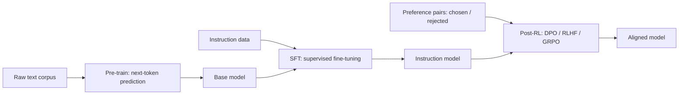

# Pre-train、SFT、Post-RL Training 学习 Notebook

这个目录是一套本地可跑的 LLM 训练阶段教学材料。它不依赖大模型下载，用一个 character-level tiny GPT 演示三件事：

1. **Pre-train**：next-token prediction。
2. **SFT**：instruction tuning，并且只对 assistant token 计算 loss。
3. **Post-RL / DPO**：用 chosen/rejected 偏好对训练 policy，使它相对 reference 更偏好 chosen。

配套文件：

- `tiny_llm_training.py`：PyTorch 模型、数据构造、SFT batch、DPO loss、生成函数。
- `llm_pretrain_sft_postrl_tutorial.ipynb`：Jupyter notebook，按阶段运行实验。
- `CODE_WALKTHROUGH_ZH.md`：notebook 代码单元逐行解释。

运行方式：

```bash
cd /mnt/c/Users/Administrator/Desktop/模型训练/llm_training_stages
python3 -m py_compile tiny_llm_training.py
jupyter lab llm_pretrain_sft_postrl_tutorial.ipynb
```

## 三阶段关系



## Loss 对比

Pre-train 和 SFT 都是 next-token cross entropy，但监督位置不同：

```text
Pre-train:
input:  x_0 x_1 x_2 ... x_T
labels: x_0 x_1 x_2 ... x_T
loss:   predict x_{t+1} from x_{<=t}

SFT:
input:  User: question Assistant: answer
labels: -100 ... -100          answer tokens
loss:   only assistant response tokens
```

DPO 使用偏好对：

```text
L_DPO = -log sigmoid(beta * ((log pi_chosen - log pi_rejected)
                           - (log ref_chosen - log ref_rejected)))
```

直觉：

- `pi` 是正在训练的 policy model。
- `ref` 是冻结的 reference model，通常是 SFT 后的模型拷贝。
- 如果 policy 比 reference 更偏好 chosen，loss 会下降。

## 学习重点

这个 notebook 的目标不是训练出可用助手，而是让你看清楚：

- 三个阶段的数据格式差异。
- pre-train loss 和 SFT loss 其实都是 causal LM loss。
- SFT 为什么要 mask user token。
- DPO 为什么需要 reference model。
- chosen/rejected logprob margin 如何反映偏好训练是否生效。

跑通这个 tiny 版本之后，再迁移到真实模型：

- SFT：Hugging Face `trl.SFTTrainer`
- DPO：Hugging Face `trl.DPOTrainer`
- GRPO：适合数学、代码、规则可验证任务
- 大规模训练：FSDP、DeepSpeed、Megatron/NeMo
